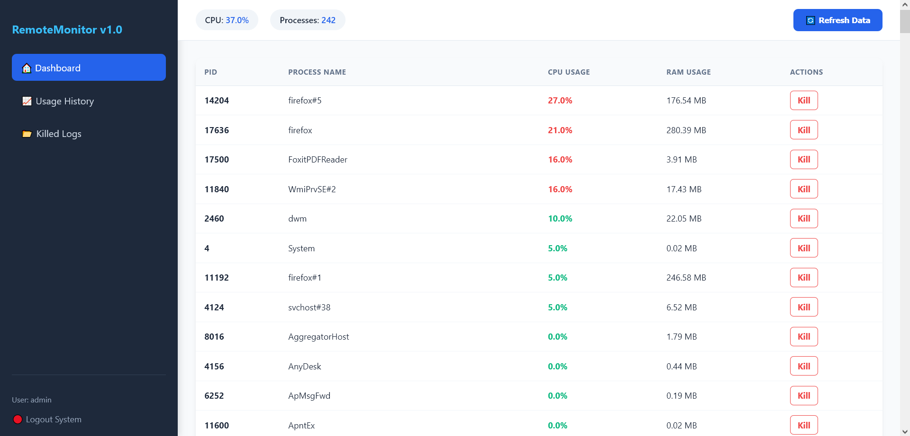
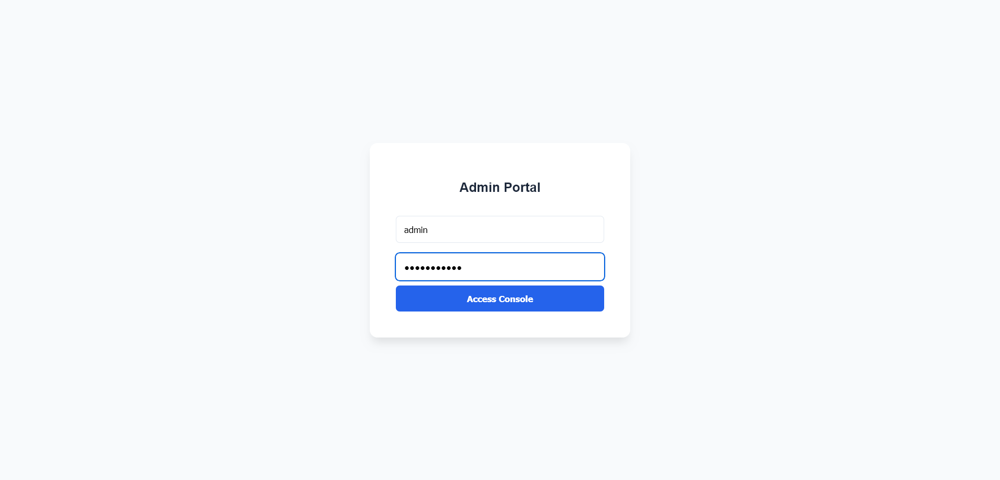
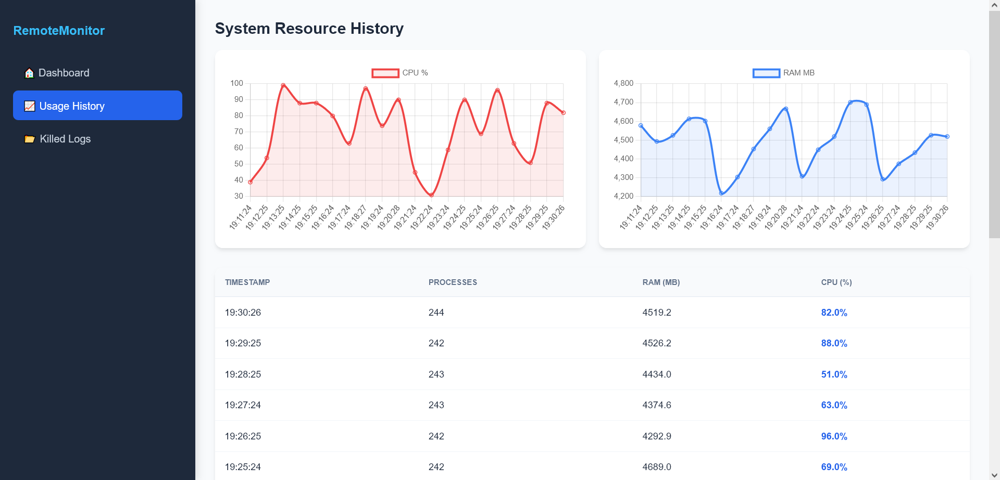
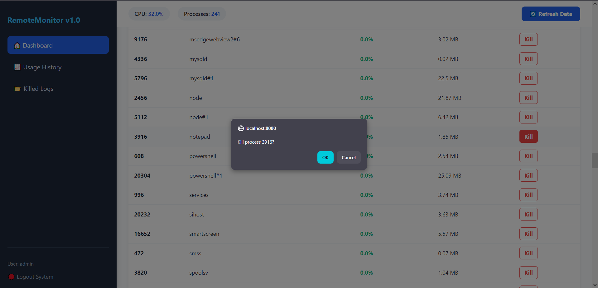
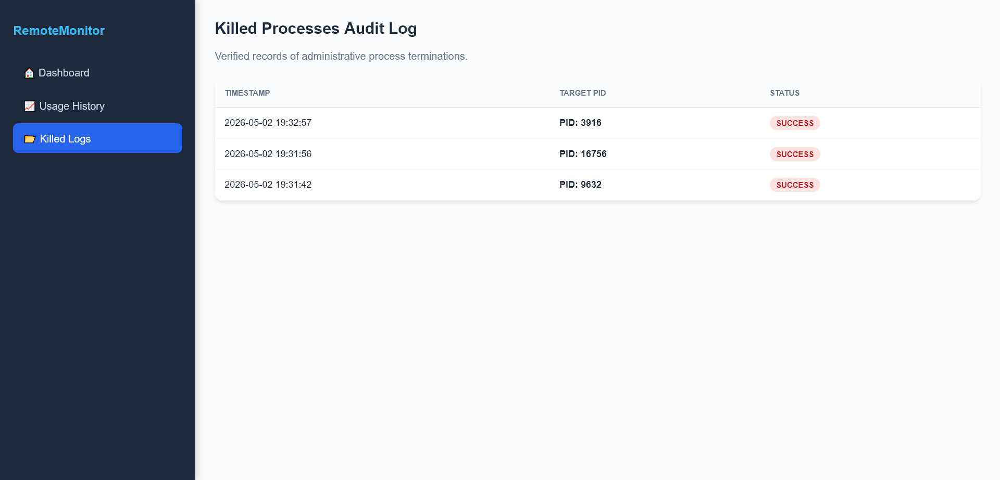

# REMOTE PROCESS & SYSTEM RESOURCE MANAGEMENT SYSTEM

## 1. Project Overview
A professional, web-based administration suite designed for real-time monitoring and remote management of host system processes. This project was developed for the 6th-semester Bachelor of Engineering (CSE) curriculum at SKIT under the VTU 2022 Scheme.

## 2. User Interface Gallery

### Admin Dashboard
The main command center featuring real-time process sorting by CPU usage and fixed sidebar navigation.

### Authentication Portal
A minimalist, secure login interface for administrative access.

### Usage History & Trends
Interactive visualization of CPU and RAM trends over time using Chart.js.

### Remote Process Termination
Direct OS-level process control with confirmation prompts.

### Audit & Security Logs
A persistent record of all administrative actions and system snapshots.

## 3. Advanced Features
- **Modern UI/UX**: Minimalist design with a fixed sidebar for seamless navigation between logs and live data.
- **Dynamic Resource Visualization**: Dual-line charts tracking system performance.
- **Remote Process Control**: Securely terminate unresponsive processes by PID.
- **Java-Driven Maintenance**: Automated logic to maintain only the latest 20 logs/metrics, ensuring optimal DB performance.
- **Windows Integration**: Utilizes PowerShell and WMI for high-accuracy hardware metric fetching.

## 4. Tech Stack
- **Backend**: Java 25 (JDK), Java Servlets, JDBC.
- **Frontend**: JSP, JavaScript (Chart.js), CSS3 (Flexbox/Sidebar layout).
- **Database**: MySQL 8.0.
- **OS Layer**: Windows Management Instrumentation (WMI).

## 5. Installation & Local Setup
1. **Database**: Execute the `database_setup.sql` in MySQL.
2. **Environment Config**: Create `src/main/java/app/db.properties` with your credentials (this file is ignored by Git).
3. **Dependencies**: Ensure `mysql-connector-j.jar` is in `src/main/webapp/WEB-INF/lib/`.
4. **Deployment**: Run on Apache Tomcat 9.0 and navigate to `http://localhost:8080/RemoteSystemManager`.

## 6. License
MIT License - Copyright (c) 2026.